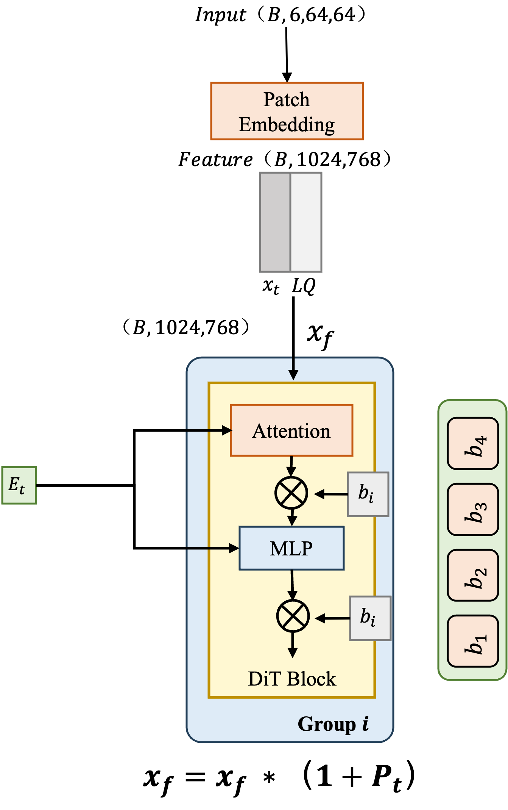

## Introduction

We propose a novel backbone architecture for raindrop removal, leveraging DiT (Diffusion Transformers) and temporally-aware prompts.  
Our experiments are conducted on **Raindrop Clarity**, a dual-focused dataset specifically designed for both day and night raindrop removal.

## Method

Here we present our proposed **temporal-aware prompt mechanism**, which leverages adjacent frames and DiT (Diffusion Transformer) backbone to enhance raindrop removal across time-consistent denosing steps. The model integrates temporal cues into prompt embeddings, ensuring both spatial and temporal coherence.




## Evaluation
```
python calculate_psnr_ssim_sid.py
```
please change `base_path`, `time_of_day`, `model_name` accordingly.

## Test
```
bash run_eval_diffusion_day.sh
```
```
bash run_eval_diffusion_night.sh
```
Inside script, please change `model_name` accordingly. 
```
CUDA_VISIBLE_DEVICES=0 python eval_diffusion_day_dit.py --sid "$sid"
```


## Train
```
train.sh
```
please change `daytime_64.yml`,`daytime_128.yml`,`daytime_256.yml` according to `model_name` and `image_size`.


